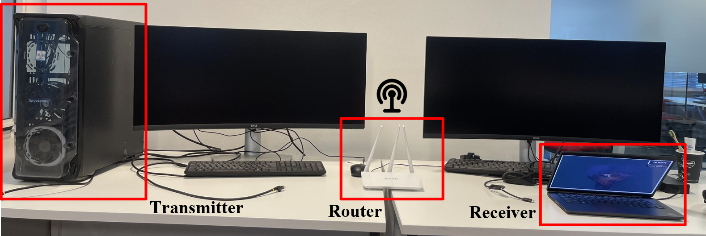

# `Task-oriented and Semantics-aware Communication Framework for Augmented Reality`

## Description

The full Python code repo will be sorted out and released after the paper is published. But the dataset used in this paper could be downloaded from the link:

https://drive.google.com/file/d/1MiXg6DMDXyHGixweo0hkDo3UJFMSKvaz/view?usp=sharing


**Fig1. Task-oriented and semantics-aware communication framework**

This research presents a task-oriented and semantics-aware communication framework for augmented reality (TSAR) to enhance communication efficiency and effectiveness in 6G, which includes semantic information extraction, task-oriented semantics-aware wireless communication, avatar pose recovery and rendering. The whole system is based on a targeting machine and a provision machine, the experimental platform details as

xxx



**Fig2. Experimental Platform**

where the two machine with a transmitter and a receiver both connect through the same WIFI Tenda 3.1 router with IP address 192.168.0.101, and 192.168.0.102. And running the Server and Client Unity system respectively.


## Getting Started

* **Prerequisites for the TSAR framework**

- Unity==2022.3.1f1
- Python==3.7.2
- Visual Studio==2019


* **Clone this repository**

```shell
git clone https://github.com/
```


- **Implement the TSAR Framework**


```shell
cd ./server
run the server code in Unity
```


**Fig.3. Transmitter Implementation**

The server file in Unity initiates by playing a 60fps video as shown in Fig.3. The code includes a script designed to transmit semantic information each time the "Space" key is pressed in every frame. Operating at a fixed update rate of approximately 0.02 seconds per frame, the code also invokes an [FM POINT](https://assetstore.unity.com/packages/tools/modeling/fm-points-163045) scan to generate a PLY Point Cloud. If you prefer, the PLY Point Cloud generation process can be disabled within the script for later modifications.

```shell
cd ./client
run the server code in Unity
```


The receiver obtains the semantic information and saves it in a local folder, the shared script follows a base TSAR semantic information and base knowledge from our paper, using skeleton position and rotation as the semantic information. It then reconstructs the avatar's position based on this local data and generate the PLY for further evaluation. The entire TSAR process can be implemented either as a whole, following this description, or step by step as depicted in Fig.1. Users are free to set up their own wireless channel, introducing noise and errors into the local data. This allows to conduct their research on the impact of such variables on wireless communication within the context of AR.


- **Semantic Extraction Network Training**


```shell
cd ./sanet
python train.py task=saliency network=(pointnet/dgcnn/pointconv/spidercnn/rsnet/rscnn)
```


The semantic extraction network is constructed on the basis of  [KeypointNet](https://github.com/charlesq34/pointnet). The running dependencies of this package largely resemble the original, with the addition of an Open3D add-on. Maintaining the same format for input and output, users can create their own dataset tailored to the specific model and avatar type used. It's important to note that, due to variations in avatar and model structures, careful consideration may be needed when determining the learning rate to ensure successful extraction.

## Dataset Description

- **Point Cloud Annotation (PLY)**


The point cloud, produced from FM POINTS, encapsulates the complete Augmented Reality (AR) landscape and written in a PLY file. Originating from a densely packed data set of more than 30,000 individual points, it's subjected to a process of downsampling, wherein it is reduced to a manageable subset of 2,048 distinct points without significantly compromising the overall visual and data integrity of the AR scenery. An Gif data input  annotation is illustrate as bellow


- **Ground Truth Label (JSON)**


The ground truth label is represented as the skeleton points of the avatar, which are written into a JSON file. Each skeleton has its own attribute information, including skeleton identification, position, rotation, color, and index number. To ensure effective communication, we use 25 skeletons to represent the avatar we use. This avatar character is downloaded from the Mixamo platform. An illustration demonstrating an example avatar along with its all skeleton is presented below.


## Video


## Please cite our paper if the source code can help you.

```
@article{wang2023credibility,
  title={A credibility-aware swarm-federated deep learning framework in internet of vehicles},
  author={Wang, Zhe and Li, Xinhang and Wu, Tianhao and Xu, Chen and Zhang, Lin},
  journal={Digital Communications and Networks},
  year={2023},
  publisher={Elsevier}
}
```
**If you have any questions during the usage of this repository, feel free to open a new issue or contact email: *tylor.wang@kcl.ac.uk***

## Acknowledgments

Inspiration, reference, avatar character, etc.
* [KeypointNet](https://github.com/charlesq34/pointnet)
* [FM POINT](https://assetstore.unity.com/packages/tools/modeling/fm-points-163045)
* [UNITY](https://forum.unity.com/threads/new-release-fm-points-capture-point-cloud-morph-dynamic-fx-ios-android-mac-pc-webgl-ar-vr.829125/)
* [Adobe Mixamo](https://www.mixamo.com/#/)
* [P2Point, PSNRy](https://github.com/zzc-1998/Point-cloud-quality-assessment)
